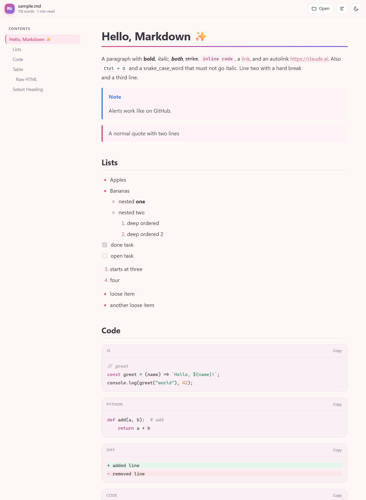
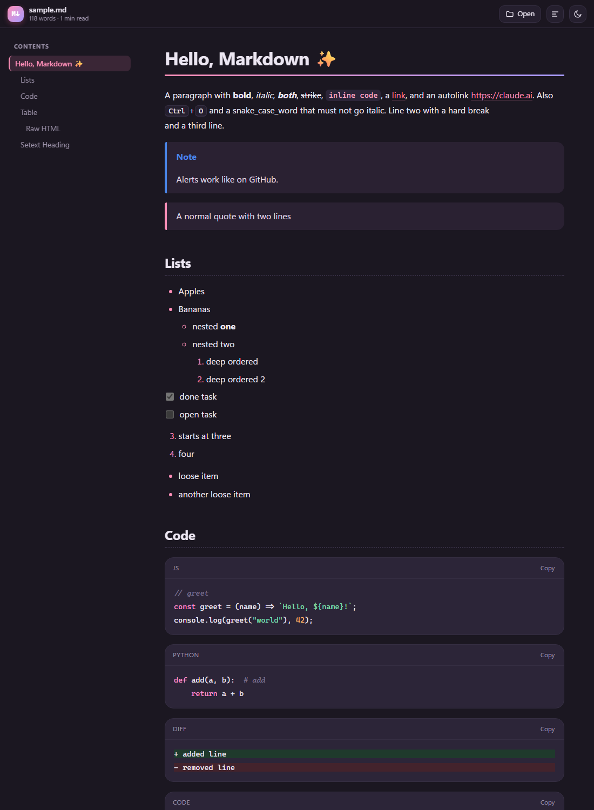
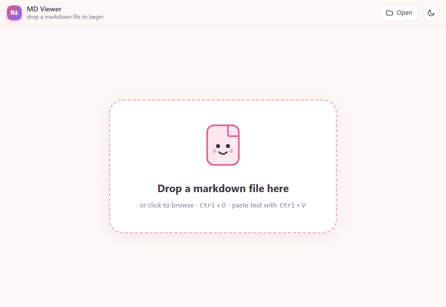

# cutemarkdown

A cute, lightweight, fast Markdown viewer for Windows. One ~29 KB HTML file, no dependencies, works offline.

- Pastel light theme + dark mode, reading-progress bar, contents sidebar with scrollspy
- Tables, task lists, nested lists, GitHub-style alerts, code blocks with copy button and syntax colours, diffs
- Raw HTML is sanitised (no scripts, no `javascript:` links)
- Drag & drop, `Ctrl+O`, or paste; files opened that way live-reload on save

## Screenshots

| Light | Dark |
|---|---|
|  |  |

## Install

Double-click `Install.cmd` (per-user, no admin). Then right-click a `.md` file → Open with → MD Viewer → Always.
Double-clicking `.md` files then opens them in a chromeless Edge (or Chrome) window.

Uninstall: `powershell -File install.ps1 -Uninstall`

## Files

| File | Purpose |
|---|---|
| `mdview.html` | The viewer (parser + UI) |
| `mdview.ps1` / `mdview.vbs` | Launcher: embeds the file into the page and opens it silently |
| `install.ps1` / `Install.cmd` | Registers file association, context menu, Start-menu shortcut |
| `sample.md` | Test document |

