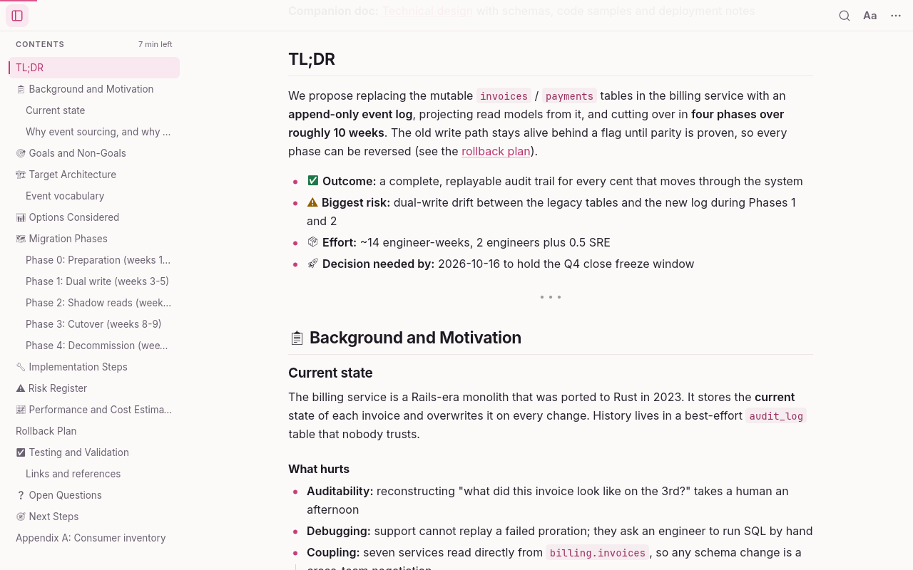
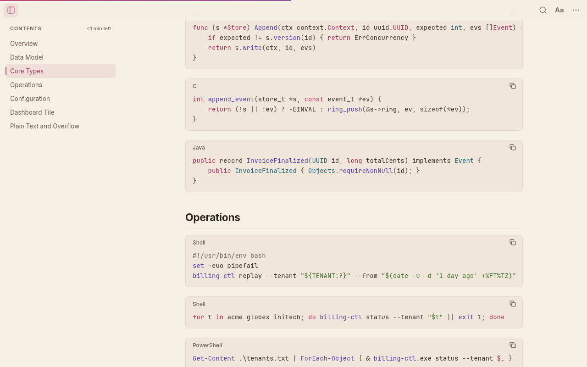
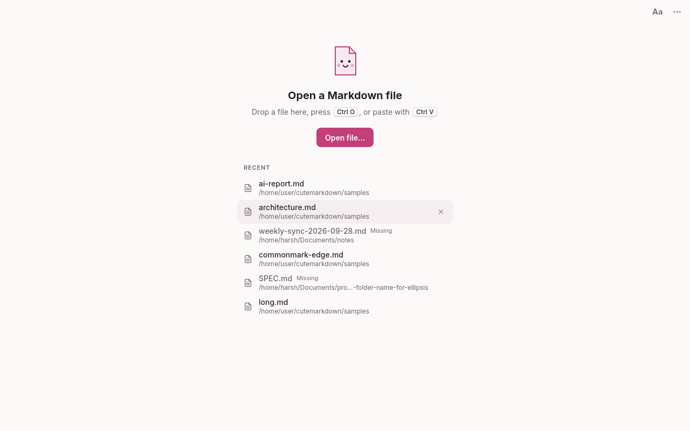

<p align="center">
  
</p>

<h1 align="center">cutemarkdown</h1>

<p align="center">
  A fast, minimal Markdown reader for Windows.<br>
  Native Rust · one small <code>.exe</code> · no Edge, no WebView, nothing else to install.
</p>

<p align="center">
  
</p>

## Features

- **Made for reading:** a comfortable column width, careful typography, Light / Sepia / Dark themes,
  and text size and width settings in one small **Aa** menu.
- **Made for technical and AI-written docs:** tables, task lists, footnotes, GitHub alerts, front
  matter, and syntax-highlighted code with a copy button. Mermaid diagrams and math show as
  labelled source.
- **Outline sidebar** that follows where you are and shows the minutes left.
- **Live reload that keeps your place.** Watch an agent write a file without losing your spot.
- **Find** (Ctrl+F) with every match highlighted, **Back / Forward** between linked `.md` files, and
  selectable, copyable text.
- **Safe by design:** no scripts, a limited set of safe HTML, links never launch programs, and opening a file never
  connects you to other machines' network shares.

<p align="center">
  
  
</p>
<p align="center">
  
</p>

## Install

Get `cutemarkdown-<version>-setup-x64.exe` (installer) or the portable zip from
[Releases](https://github.com/harsh9524/cutemarkdown/releases), or from the latest
[CI build](https://github.com/harsh9524/cutemarkdown/actions/workflows/ci.yml) under **Artifacts**.
The installer is per-user: no admin rights, no UAC prompt. To make it your default Markdown app,
tick the box at the end of setup. Windows 10 or 11, 64-bit.

More detail, including silent installs and uninstalling, is in [docs/INSTALL.md](docs/INSTALL.md).

## Shortcuts

Ctrl+O open · Ctrl+F find · Alt+← / → back / forward · Ctrl+B outline · F11 zen ·
Ctrl+= / − / 0 text size · Ctrl+Shift+L theme · Ctrl+E open in editor · Ctrl+/ all shortcuts

## Build

```sh
cargo run --release -- path/to/file.md
```

`scripts/build-windows.sh` cross-compiles the `.exe`, installer and zip from Linux. The code lives in
`crates/engine/` (the Markdown engine) and `src/` (the app); the design spec is in
[docs/design/SPEC.md](docs/design/SPEC.md).

## Credits

Fonts are Inter, Literata, JetBrains Mono and Noto Emoji (SIL Open Font License). Icons are from Lucide
(ISC). Built with [egui](https://github.com/emilk/egui), [comrak](https://github.com/kivikakk/comrak)
and [syntect](https://github.com/trishume/syntect).
