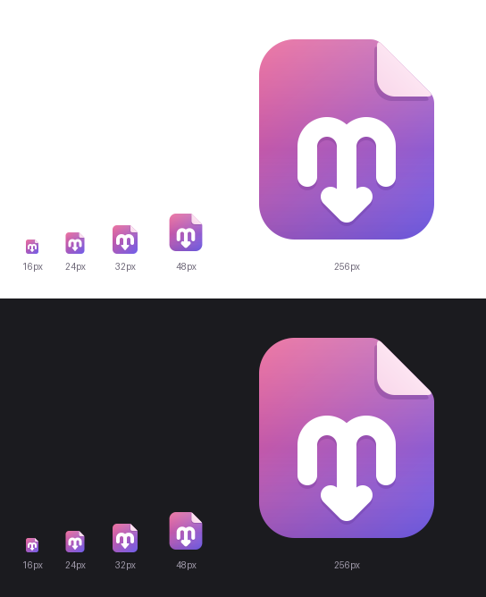

# cutemarkdown brand mark



## Concept

A soft, chubby page with a folded corner. On it, one rounded stroke draws a lowercase **m** whose middle leg keeps going down into an arrow. That fuses Markdown's familiar `M↓` into a single glyph we own, instead of the generic badge everyone uses. Together, the two arches and the arrow point make a quiet heart silhouette, so the "cute" comes from the shape itself rather than a face. The page shape works both as the app icon and as the `.md` file-type icon. The symmetric mark avoids the zodiac-glyph look you get when an arrow hangs off the m's right leg. Below 40 px a separate drawing on a 16 px grid takes over: a wider page, a smaller fold, 2 px strokes on whole pixels and a solid arrowhead, so it stays crisp at 16 and 24 px.

## Colours

| Role | Hex | Notes |
|---|---|---|
| Rose (gradient start, top-left) | `#E8558C` | refined from heritage `#E0558A` |
| Violet (gradient end, bottom-right) | `#6F5FEA` | deeper than heritage `#7C6FF0` |
| Flat fallback (one colour) | `#AC5ABB` | gradient midpoint, for single-colour uses |
| Fold / blush | `#F9D6EA` → `#FFF3F9` | folded-corner flap |
| Mark | `#FFFFFF` | |
| Plum shadow | `#3A1268` | 16–22 % opacity, under the fold and the mark only |

Gradient runs diagonally top-left → bottom-right, with a soft white sheen at the top (22 % → 0).

## Files

| File | Use |
|---|---|
| `logo.svg` | Master icon, 40 px and up (README header, installer, in-app 64–96 px) |
| `logo-small.svg` | 16–32 px variant (pixel-grid tuned) |
| `png/logo-<size>.png` | 16, 24, 32 (small) and 48, 64, 128, 256, 512 (master) |
| `app.ico` | Windows icon: 16, 20, 24, 32 (small) + 40, 48, 64, 128, 256 (master); BMP entries below 256, PNG at 256 |
| `preview.png` | Review sheet, light and dark backgrounds |

## Rebuild

```sh
pip install cairosvg pillow
python assets/brand/build_icons.py
```

Edit only the two SVGs. Everything else is generated.
