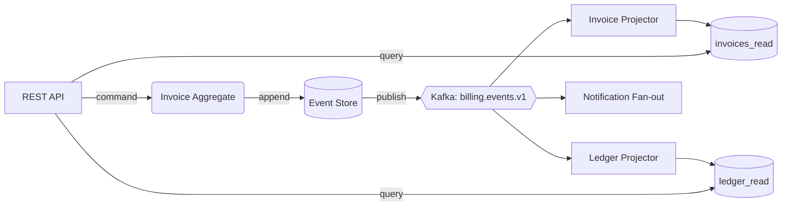

# 🚀 Migration Plan: Moving the Billing Service to Event Sourcing

**Prepared for:** Platform Engineering and Finance Systems  
**Scope:** `billing-service` (v4.x), its Postgres schema, and the 7 downstream consumers listed in [Appendix A](#appendix-a-consumer-inventory)  
**Companion doc:** [Technical design](./architecture.md) with schemas, code samples and deployment notes

## TL;DR

We propose replacing the mutable `invoices` / `payments` tables in the billing service with an **append-only event log**, projecting read models from it, and cutting over in **four phases over roughly 10 weeks**. The old write path stays alive behind a flag until parity is proven, so every phase can be reversed (see the [rollback plan](#rollback-plan)).

- ✅ **Outcome:** a complete, replayable audit trail for every cent that moves through the system
- ⚠️ **Biggest risk:** dual-write drift between the legacy tables and the new log during Phases 1 and 2
- 📦 **Effort:** ~14 engineer-weeks, 2 engineers plus 0.5 SRE
- 🚀 **Decision needed by:** 2026-10-16 to hold the Q4 close freeze window

---

## 📋 Background and Motivation

### Current state

The billing service is a Rails-era monolith that was ported to Rust in 2023. It stores the **current** state of each invoice and overwrites it on every change. History lives in a best-effort `audit_log` table that nobody trusts.

#### What hurts

- **Auditability:** reconstructing "what did this invoice look like on the 3rd?" takes a human an afternoon
- **Debugging:** support cannot replay a failed proration; they ask an engineer to run SQL by hand
- **Coupling:** seven services read directly from `billing.invoices`, so any schema change is a cross-team negotiation
  - **Reporting:** reads 14 columns, three of them undocumented
    - **Finance exports:** relies on a `status` value (`'legacy_void'`) that no code path writes anymore
      - **Month-end close:** hard-codes a column ordering in a CSV template
  - **Notifications:** polls every 30 seconds instead of subscribing to changes

### Why event sourcing, and why now

Three things changed this year: audit requirements tightened (our SOC 2 auditors asked for point-in-time reconstruction[^2]), the Kafka platform became generally available internally, and our proration logic grew to the point where **replaying history** is the only credible way to test it.[^1]

> [!NOTE]
> Event sourcing is not a silver bullet. It trades simple writes for simple history. We are choosing it because our dominant pain is *history*, not write throughput.

## 🎯 Goals and Non-Goals

| Goals | Non-goals |
| :--- | :--- |
| Every state change is an immutable, versioned event | Rewriting the pricing engine |
| Read models can be rebuilt from scratch in under 2 hours | Changing the public REST API contract |
| Downstream consumers subscribe instead of polling | Migrating historical data older than 7 years |
| Zero customer-visible downtime during cutover | Replacing Stripe or Adyen |

## 🏗️ Target Architecture

At a high level, commands are validated against an aggregate, which emits events to the log. Projectors consume the log and maintain read models; the REST layer reads only from projections.



> [!TIP]
> Keep aggregates small. In our domain an `Invoice` is one aggregate and a `PaymentAttempt` is another; resist the urge to make a giant `Customer` aggregate.

### Event vocabulary

The initial event set is intentionally small:

- `InvoiceDrafted`, `InvoiceFinalized`, `InvoiceVoided`
- `LineItemAdded`, `LineItemAdjusted`
- `PaymentAttempted`, `PaymentSucceeded`, `PaymentFailed`, `RefundIssued`

## 📊 Options Considered

| Option | Complexity | Audit trail | Migration risk | Cost / month | Verdict |
| :--- | :---: | :---: | :---: | ---: | :---: |
| Keep current tables, harden `audit_log` | Low | Partial | Low | $0 | ❌ Rejected |
| Postgres triggers + `history` tables | Medium | Good | Low | $120 | 🟡 Fallback |
| Event log in Postgres (`events` table) | Medium | Complete | Medium | $340 | ✅ **Chosen** |
| Dedicated store (`EventStoreDB`) | High | Complete | High | $2,900 | ❌ Rejected |
| Kafka as the system of record | High | Complete | High | $1,450 | ❌ Rejected |

For readers who want the full inventory of what has to move, the table below is deliberately wide. It lists the four heaviest of the seven consumers with its current access path, owner, and cutover requirements.

| Consumer | Owner | Access path today | Tables read | Rows / day | Latency budget | Cutover strategy | Contract test | Notes |
|---|---|---|---|---|---|---|---|---|
| `reporting-api` | Data Platform | Direct SQL (read replica) | `invoices`, `line_items`, `customers` | 1,200,000 | 5 min | Switch to `invoices_read` view, then drop grants | `reporting_contract_v3` | Needs a compatibility view with the legacy `legacy_void` status |
| `finance-export` | Finance Systems | Nightly `COPY` job | `invoices`, `payments`, `ledger` | 340,000 | 24 h | Re-point to `ledger_read`; compare totals for 14 nights before cutover | `export_checksum_check` | Month-end template depends on exact column order |
| `notifier` | Growth | Polls every 30 s | `invoices` | 85,000 | 60 s | Subscribe to `billing.events.v1` | `notifier_replay_suite` | Must de-duplicate by `event_id` |
| `tax-service` | Compliance | REST + direct SQL | `invoices`, `tax_lines` | 52,000 | 2 s | REST only after Phase 3 | `tax_contract_v2` | Direct SQL access revoked at end of Phase 3 |

---

## 🗺️ Migration Phases

### Phase 0: Preparation (weeks 1-2)

- **Freeze the schema.** No new columns on `invoices` without review
  - Announce in `#eng-billing` and `#eng-platform`
  - Add a CI check that fails on migrations touching frozen tables
    - Implemented as a `sqlfluff` rule plus a small allow-list
      - Allow-list changes require a Finance Systems approver
- **Inventory consumers.** Confirm every reader and writer of `billing.*`
- **Baseline metrics.** Capture p50/p95/p99 for the five busiest endpoints

### Phase 1: Dual write (weeks 3-5)

The service writes to the legacy tables *and* appends events, in a single transaction.

- ✅ **Benefit:** events are produced from real traffic immediately
- ⚠️ **Risk:** the transaction now touches more rows, which may raise lock contention
- 📦 **Exit criteria:** 99.99% of invoices have a matching event stream for 7 consecutive days

### Phase 2: Shadow reads (weeks 6-7)

Projectors build read models in the background. The REST layer compares projection output with legacy output and logs differences, but still serves the legacy result.

### Phase 3: Cutover (weeks 8-9)

Reads move to projections behind a per-tenant flag. Writes move to the event store only after reads are stable.

### Phase 4: Decommission (week 10+)

Revoke direct grants, archive legacy tables, and delete the dual-write code path.

> [!IMPORTANT]
> Do not start Phase 3 until the parity dashboard has been green for **seven consecutive days** and Finance has signed off on the reconciliation report.

## 🔧 Implementation Steps

1. **Create the event store schema.** Apply the migration to a staging database first:

   ```sql
   CREATE TABLE billing.events (
       event_id     uuid        PRIMARY KEY,
       stream_id    uuid        NOT NULL,
       version      integer     NOT NULL,
       event_type   text        NOT NULL,
       payload      jsonb       NOT NULL,
       occurred_at  timestamptz NOT NULL DEFAULT now(),
       UNIQUE (stream_id, version)
   );
   ```

2. **Add the aggregate and command handler.** The handler loads the stream, applies the command, and appends new events with optimistic concurrency:

   ```rust
   pub async fn handle(&self, cmd: FinalizeInvoice) -> Result<Vec<Event>, BillingError> {
       let mut invoice = self.repo.load(cmd.invoice_id).await?;
       let events = invoice.finalize(cmd.finalized_by)?;
       self.repo.append(invoice.id(), invoice.version(), &events).await?;
       Ok(events)
   }
   ```

   - **Note:** `append` returns `ConcurrencyConflict` if another writer got there first
   - **Note:** callers should retry at most 3 times with jittered backoff

3. **Backfill historical invoices.** Run the backfill in batches, one tenant at a time:

   ```bash
   cargo run --release --bin backfill -- \
     --tenant "$TENANT_ID" \
     --batch-size 500 \
     --dry-run=false
   ```

   Verify the counts afterwards:

   ```sql
   SELECT count(DISTINCT stream_id) AS streams, max(version) AS max_version
   FROM billing.events
   WHERE stream_id IN (SELECT id FROM billing.invoices WHERE tenant_id = :tenant);
   ```

4. **Enable shadow reads.** Flip the flag for 1% of tenants, then 10%, then 50%:

   ```yaml
   flags:
     billing.shadow_reads:
       default: false
       rollout:
         - { percent: 1,  tenants: ["internal-demo"] }
         - { percent: 10, after: 48h }
         - { percent: 50, after: 72h }
   ```

5. **Cut over reads, then writes.** Each flip is a separate deploy and a separate sign-off.

## ⚠️ Risk Register

- **Risk:** Dual-write drift between legacy tables and the event log
  - **Likelihood:** Medium
  - **Impact:** High, since reconciliation errors are visible to Finance
  - **Mitigation:** Write both inside one database transaction; run a nightly diff job
    - The diff job emits a metric, `billing_dual_write_drift_total`
      - Alert at >0 for 10 minutes; page at >0 for 1 hour
- **Risk:** Event schema mistakes are permanent
  - **Mitigation:** Version every event type (`InvoiceFinalized.v1`) and write upcasters instead of editing history
- **Risk:** Projection lag during month-end peak
  - **Mitigation:** Pre-scale projectors and rehearse a full replay on the Tuesday before close
- **Risk:** Team unfamiliarity with the pattern
  - **Mitigation:** Two brown-bag sessions and a pairing rota in the first three weeks

> [!WARNING]
> Month-end close runs from the 28th to the 3rd. No cutover steps may be scheduled in that window.

## 📈 Performance and Cost Estimates

Replaying a single tenant's stream is linear in the number of events, so a full rebuild costs $O(n)$ for $n$ events. Sorting events by `occurred_at` during reconciliation adds an $O(n \log n)$ step, which is acceptable at our scale.

The projected rebuild time for the whole fleet is:

$$
T_{\text{rebuild}} = \frac{N_{\text{events}}}{R_{\text{throughput}} \cdot P_{\text{workers}}} + T_{\text{snapshot}}
$$

With $N = 2.4 \times 10^9$ events, $R = 25{,}000$ events/s per worker and $P = 16$ workers, we expect roughly **100 minutes**, which is inside our 2-hour goal.

| Metric | Today | Projected | Change |
| --- | ---: | ---: | ---: |
| p95 invoice finalize | 180 ms | 210 ms | +17% |
| p95 invoice read | 45 ms | 18 ms | -60% |
| Storage (hot) | 210 GB | 540 GB | +157% |
| Monthly cost | $1,100 | $1,440 | +$340 |

## Rollback Plan

Every phase has a defined, tested way back. The rule of thumb: **flags first, data second, code last**.

1. **Phase 1 or 2 problem.** Turn off the `billing.dual_write` flag. Legacy tables remain the source of truth, so no data is lost.
2. **Phase 3 problem (reads).** Set `billing.read_from_projections=false` for the affected tenants. This takes effect within one deploy-free config refresh (about 30 seconds).
3. **Phase 3 problem (writes).** Re-enable the legacy write path and replay events written since cutover into the legacy tables:

   ```bash
   billing-ctl replay --from-event "$LAST_GOOD_EVENT_ID" --target legacy --verify
   ```

4. **Phase 4 problem.** Restore archived tables from the snapshot taken at the start of Phase 4.

> [!CAUTION]
> Dropping the legacy tables is irreversible without a restore from backup. Require a second approver and a verified snapshot before running `DROP`.

## ✅ Testing and Validation

- [x] Unit tests for every aggregate invariant
- [x] Property-based tests for proration (`proptest`, 10k cases)
- [ ] Contract tests for all seven consumers
  - [x] `reporting-api`
  - [x] `notifier`
  - [ ] `finance-export`
    - [x] Column order fixture
    - [ ] Month-end checksum comparison
  - [ ] `tax-service`
- [ ] Full replay rehearsal in staging
- [ ] Game day: kill the projector during peak load

### Links and references

- Pattern overview: [Event Sourcing by Martin Fowler](https://martinfowler.com/eaaDev/EventSourcing.html)
- Platform docs: [Apache Kafka documentation](https://kafka.apache.org/documentation/)
- Storage: [PostgreSQL 16 JSON types](https://www.postgresql.org/docs/16/datatype-json.html)

## ❓ Open Questions

1. Should `RefundIssued` carry the original payment's currency, or look it up at projection time?
2. Do we snapshot every 100 events or every 500? We need real stream-length data from the backfill.

---

## 🧭 Next Steps

- [ ] Review this plan and leave comments by **2026-10-09**
- [ ] Finance Systems to confirm the reconciliation sign-off criteria
- [ ] SRE to size the Kafka topic (`billing.events.v1`, 24 partitions proposed)
- [ ] Platform to approve the schema freeze and CI check
- [ ] Schedule the Phase 0 kickoff for the week of **2026-10-19**

## Appendix A: Consumer inventory

See the wide table in *Options Considered* above for the full list; the technical details of each integration are in [architecture.md](./architecture.md#data-model).

[^1]: Proration rules changed three times in 2025. Each change required a manual backfill that engineers described as "archaeology". See the [Kafka documentation](https://kafka.apache.org/documentation/) for retention semantics relevant to replays.
[^2]: SOC 2 Type II auditors asked specifically for "point-in-time reconstruction of financial records" in the last review cycle.
